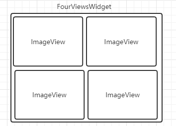

# **VTK 代码架构说明文档**

## **1. VTK 整体架构**

## **2. uiframe 结构**

### **（1）主界面显示部件类说明**

#### **I. MainFrame 类**

主界面主布局，实现对 widget 块填充，如下图:

#### **II. TitleBarWidget类**

实现项目名称、公司 Logo、软件名称修改的接口，实现跳转设置页面、切换语言、切换致关于页面等逻辑实现，同时实现最小化、最大化、关闭软件的逻辑。

#### **III. SingleViewWidget、DoubleViewsWidget、ThreeViewsWidget、FourViewsWidget、MultiViewsWidget 类**

这些类主要是按照 ImageView 对象个数不同提供的一个布局类，例如FourViewsWidget类:

例如 MultiViewsWidget 类:

#### **IV. ImageView 类**

图像视窗类，实现对图像的显示、提供对显示图像的操作以及图像运行后的一些结果显示，结构如下：

#### **V. OperationalControlWidget 类**

该类主要实现运行状态的控制和显示。

#### **VI. StatisticsWidget 类**

该类主要对检测总判定结果的统计显示。

#### **VII. DataListWidget 类**

该类主要对本地导入的图片推理运算后的一些数据以表格的方式进行显示，支持条件筛选及数据导出。

#### **VIII. LogWidget 类**

该类主要是实现对软件运行时的一些日志以表格的方式进行显示，同样支持条件筛选及数据导出。

#### **IX. AboutWidget类**

该类主要是实现软件关于软件产品的一些版本信息以及公司官网入口。

### **（2）配置界面显示部件类说明**

#### **I. ConfigDialog类**

配置页面主显示框，包括左侧 tabs，取消保存按钮，以及一个 stackedwidget，用于显示每个设置页面。

#### **II. SystemSettingPage 类**

系统设置页面，主要功能用于配置系统名称及系统logo。

#### **III. CameraSettingPage 类**

相机设置页面，由左侧相机列表以及右侧一个 stackedwidget 构成，用于配置扫描到的所有相机。

#### **IV. ModelSettingPage 类**

模型设置页面,可配置各类型的算法对应的导入模型，及控制是否开启 GPU 运算。

#### **V. ImageSourcePage 类**

图像数据源配置页面，可配创建多个图像数据，配置图像数据源名称，对应的触发字符、层级及层级顺序，便于适应更多场景的输入控制。

#### **VI. ViewSettingPage 类**

显示视图配置页面，可配创建多个图像显示视图，配置视图名称、数据源以及对应的推理模型，可以对应多个模型。

#### **VII. SaveSettingPage 类**

保存设置页面，可对原图及渲染图的保存进行配置，包括是否保存、OK/NG 条件保存、保存路径、保存格式及保存达到上限时的删除策略进行配置。

### **（3）通用显示部件类说明**

#### **I. ToastWidget、 ToastWidget、TipWidget、WarningDialog 提示类**

不同类型的弹出提示框，主要用于配置页面在配置数据时的特定场景的个性化提示。

#### **II. TableWidget、TableModel 类**

表格显示部件，像数据列表、日志都会用到此表格类。

#### **III. ImageGraphicsView、ImageGraphicsScene、ImageGraphicsItem 类**

图像显示视窗，在主界面视图显示及配置页面相机显示都会用到该类。

### **（4）图标资源说明**

软件所用到的所有图标资源都会放到 images 文件夹中，然后添加到资源文件中，在项目中使用。

### **（5）字体资源说明**

软件使用的字体文件存放在 font 目录下，目前使用的是 PingFangRegular 字体，免费的，后面也可以根据需求替换成其他字体，添加到资源文件中使用。

### **（6）样式资源说明**

整体软件所有的部件的样式都存放在 style 文件夹下的 stylesheet.qss 样式文件中，便于集中管理，快速换肤。

### **（7）国际化翻译说明**

国际化翻译文件存放在 translations 文件夹下，目前暂时只支持中、英两种语言，后续可根据需求增加更多国家的语言支持。

## **3. runtimecontroller 运行控制模块**

RuntimeController 主要负责运行控制管理，对接UI模块发出的运行指令，然后协调相机模块采图或直接获取到本地图片作为数据源，然后控制传入算法服务模块，进行推理运算，最终得到推理结果及状态，最终对接 UI 模块进行结果数据展示、调度图像保存模块进行图像保存以及调度日志模块保存运行日志。

## **4. cameraservice 相机服务模块**

该模块主要是负责管理已支持的各个厂商的相机设备及扩展新的厂商设备，对接各个厂商相机的 sdk，并提相机设备的一些操作接口给其他模块，比如提供相机参数配置接口给UI模块、提供控制采集接口给运行控制模块等。

## **5. aialgoservice算法服务模块**

该模块主要负责管理四种标准的算法类型及扩展新的算法类型，对接各个算法 sdk，提供给一些算法对象的操作结构给其它模块，比如提供初始化及运行接口给运行控制模块调度。

## **6. configdatamanager 配置数据管理模块**

该模块主要是管理整个软件配置方案的所有数据，包括定义整个方案的所有的数据结构、提供将方案数据序列化保存到文件的接口、提供从文件中把数据反序列化到内存的接口以及提供丰富的数据访问、修改接口给其它模块。

## **7. imagesaver 图像保存模块**

该模块提拱了对图像异步保存及删除接口，主要对接运行管理模块，实现对原图及渲染图的保存功能。

## **8. logservice 日志服务模块**

该模块主要是对运行时的一些必要信息进行记录，然后对接 UI 模块展示给用户查看。

## **9. common 通用模块**

该模块主要实现软件中使用到的一些通用方法，多模块都使用到的一些数据、类的定义。
