# **VTK 运行平台开发指南**

## **开发环境配置篇：**

### **Windows 平台：**

1. 获取开发环境所需要的所有安装包，获取地址：ftp://192.168.5.92/ 完整开发环境。

2. 进入 FTP 服务器后，可看到如下列表：

    ```
    ├─linux
    │
    └─windows
    ```

    其中 windows 文件夹下是放置 Windows 平台开发环境所需的所有安装包，linux 文件夹下放置的是 Linux 平台开发环境所需的所有安装包。

3. 先进入到 windows 文件夹下，可以见到以下列表：

    ```
    ├─windows
        │ 　clangformat.txt
        │ 　cmake-3.18.3-win64-x64.msi
        │ 　Git-2.28.0-64-bit.exe
        │ 　LLVM-11.0.0-win64.exe
        │ 　python36.dll
        │ 　qt-opensource-windows-x86-5.14.1.exe
        │ 　VMware-workstation-full-16.0.0-16894299.exe
        │ 　vmware密钥.txt
        │
        ├─basler
        │ 　Basler_pylon_6.1.1.19832.exe
        ├─dalsa
        │ 　sapera_lt_850_sdk.exe
        ├─hik
        │ 　MVS_STD_3.2.1_200609.exe
        └─vs2017
    　　　qt-vsaddin-msvc2017-2.6.0.vsix
    　　　vs_Community.exe
    ```

    开发需要安装软件有：vs2017、qt5.14.1、cmake、Git、LLVM 、相机 SDK（Basler_pylon、sapera_lt_850_sdk、MVS）。

4. 安装 vs2017

   进入到 vs2017 文件夹下，双击 vs 安装程序 vs_Community.exe,  等待片刻出现如下窗口，按下图勾选，

    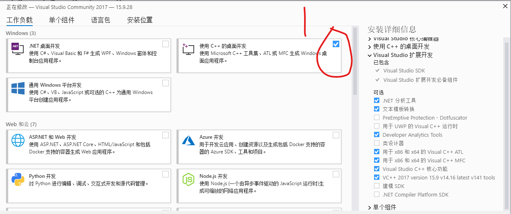

    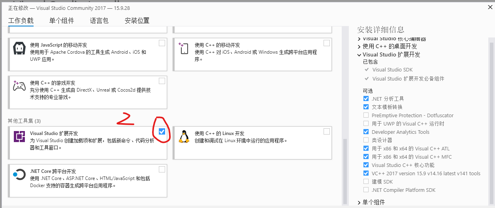

    勾选完后，然后点击安装，等待安装完成即可。

5. 安装 vs2017 对应 Qt 的插件

   同样是在 vs2017 目录下，双击安装 qt-vsaddin-msvc2017-2.6.0.vsix，等待安装完成即可。


6. 进入到 Windows 系统的应用与功能页面，找到 Windows Software Development Kit，点击修改，如下图：

    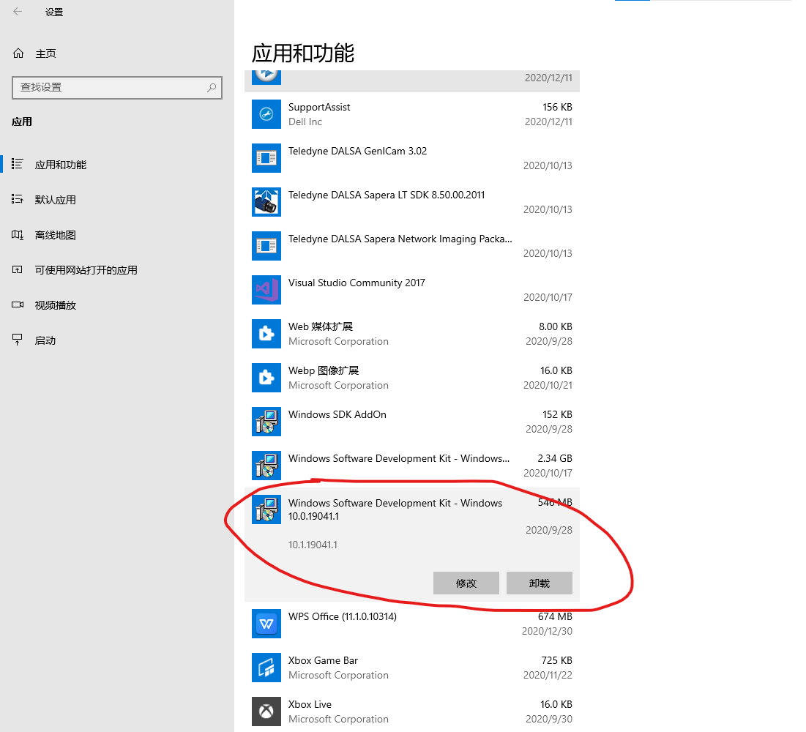

    点击修改后，会弹出图下窗口，勾选上 Debugging Tools for Windows，然后点击 Change，

    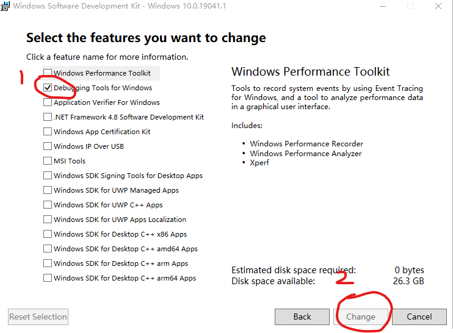

    等待调试器安装完即可。

7. 安装 Qt

    先将电脑网线断开，然后在 windows 目录下，找到 qt-opensource-windows-x86-5.14.1.exe，并双击运行，一直点击下一步，直到弹出如下界面：

    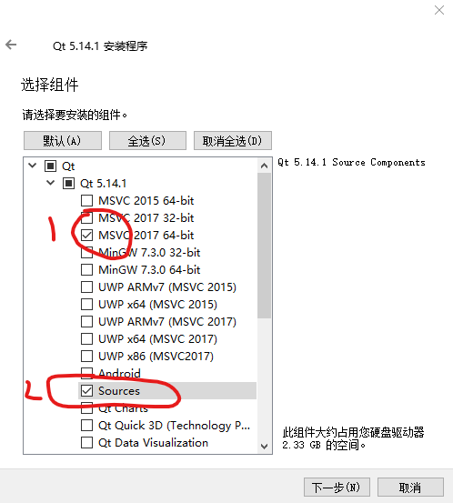

    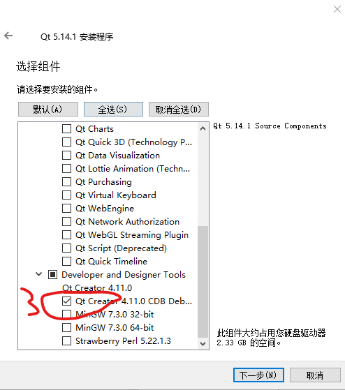

    按照上图勾选即可，然后一直下一步，最后点击安装，等待安装完成即可。

8. 安装 CMake

   在windows目录下找到cmake-3.18.3-win64-x64.msi 安装包，按照默认选项安装即可。

9.  安装 Git

    在windows目录下找到 Git-2.28.0-64-bit.exe 安装包，按照默认选项安装即可。

10. 安装 LLVM

    在windows目录下找到 LLVM-11.0.0-win64.exe 安装包，按照默认选项安装即可。

11. 安装 basler 相机 sdk

    在 basler 目录下找Basler_pylon_6.1.1.19832.exe 安装包，按照默认选项安装即可。

12. 安装 dalsa 相机 sdk

    在 dalsa 目录下找到sapera_lt_850_sdk.exe 安装包，按照默认选项安装即可。

13. 安装 hik 相机 sdk

    在 hik 目录下找到MVS_STD_3.2.1_200609.exe 安装包，按照默认选项安装即可。

14. 所有软件安装完毕后，还需配置一下 vs2017 及 Qt Creator。

    **配置 vs2017 ：**

    配置 vs2017 支持打开并开发 Qt 工程，打开 vs2017，找到 Qt VS Tools >> Qt Options，如下图：

    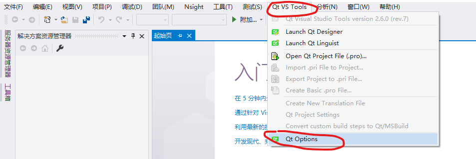

    然后进入 Qt Options，出现如下界面：

    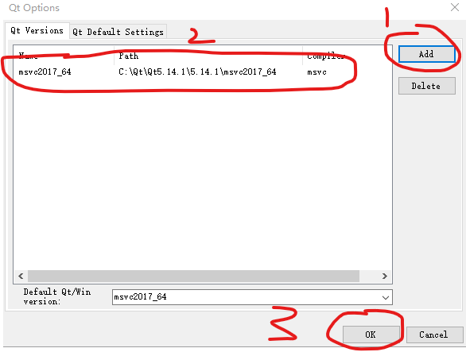

    然后按照上图步骤添加 Qt 安装路径，点击OK即可。

    **配置 Qt Creator：**

    1. 配置 Qt Creator 环境

        先打开 Qt Creator，找到工具 >> 选项，

        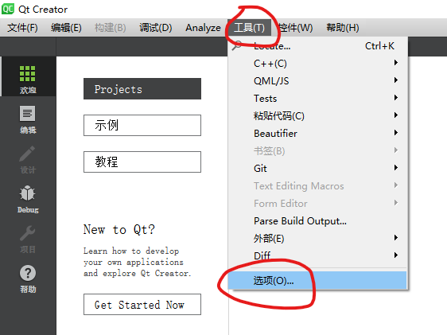

        然后进入选项显示如下界面：

        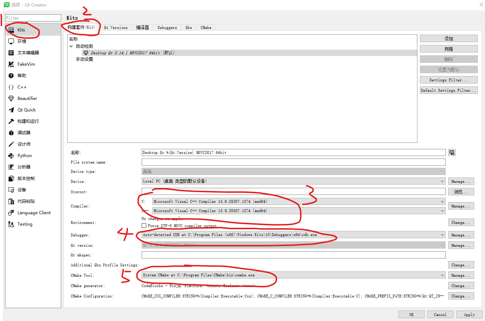

        按照上图步骤，确认一下编译器、调试器、CMake 插件是否都正确，特别注意第三步，如果机器是 64 位的，要选择（amd64）的编译器，如果机器是 32 位的，要选择（x86）编译器，目前公司的电脑都是 64 位的。

    2. 开启 Beautifier 设置

        按下图找到关于插件

        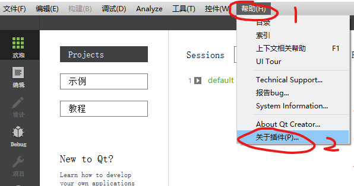

        进入关于插件，弹出如下界面：

        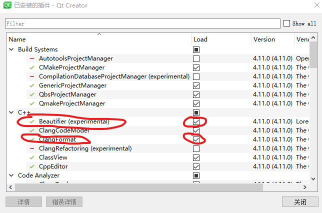

        按上图勾选，然后点击关闭重新打开 Qt Creator。找到 Beautifier 设置页面，如下图：

        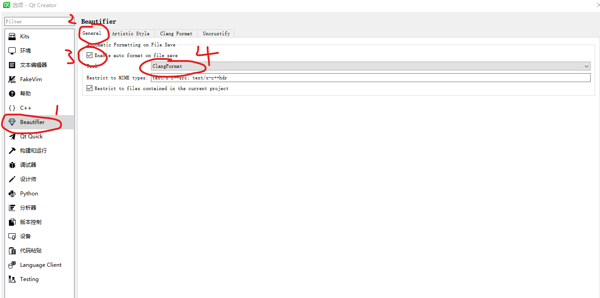

        按照上图步骤配置 General 页面，在保存代码文件时，自动调用 Clang Format 工具格式化代码，保证代码风格统一，此外还需在 Clang Format 页面，做如下配置：

        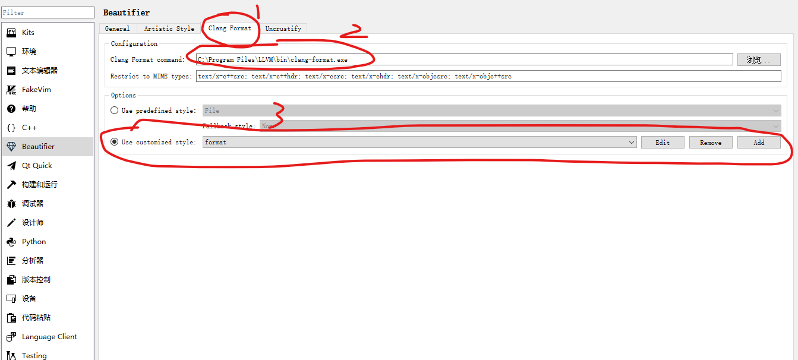

        在第三步时，需要点击 Add，弹出如下画面

        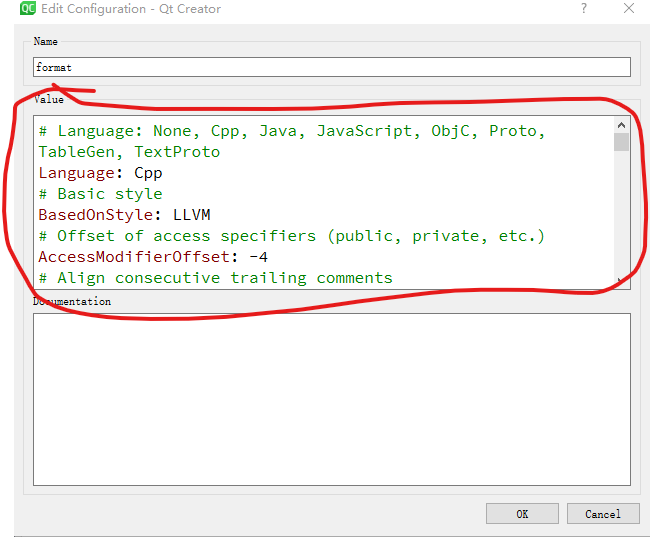

        需要将格式化规则填到 Value 的编辑框中，目前 VTK 代码的格式化规则在 FTP 服务器 windows 目录下的 clangformat.txt 文件中，找到该文件，打开并将文件的内容复制到上图的 Value 的编辑框中即可。

    3. 消除 ClangCodeModel 组件触发的一些警告和错误，找到 C++ 配置页面

        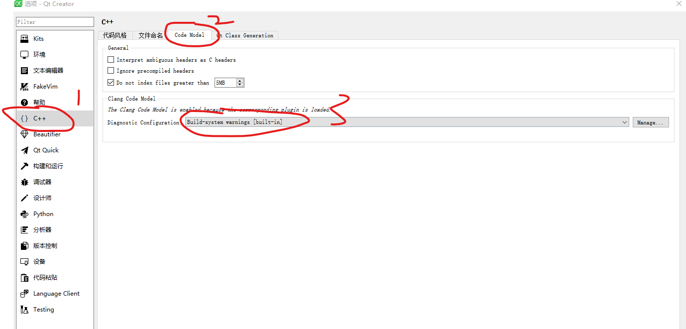

        按照上图步骤配置 Code Model 页面，即可消除 ClangCodeModel 一些警告和错误。

15. 由于安装了软件 LLVM-11.0.0-win64.exe，在打开 Qt Creator 时，会弹出提示缺少库 python36.dll，此时只需在 windows 目录找到 python36.dll，将其拷贝到 C:\Windows\System32 目录下即可。

**至此，整个 VTK 在 Windows 平台所需要的开发环境就全部配置好了。**

### **Linux 平台：**

1. 再进入到 linux 文件夹下，可以见到以下列表：
    ```
    ├─linux
    │ 　clang+llvm-10.0.0-x86_64-linux-gnu-ubuntu-18.04.tar.xz
    │ 　qt-opensource-linux-x64-5.14.1.run
    │ 　ubuntu-18.04.5-desktop-amd64.iso
    │
    ├─basler
    │ 　pylon_6.1.1.19861_linux-x86_64_setup.tar.gz
    │
    └─hik
    　　MVS-2.0.0_x86_64_20191126.zip
    ```

2. 先在 Windows 系统上安装一个虚拟机 VMware-workstation，安装包 VMware-workstation-full-16.0.0-16894299.exe 位置在 windows 目录下。安装完后，输入 VMware-workstation 密钥激活，密钥在 windows 目录下的 vmware密钥.txt 文件中。

3. 打开 VMware 虚拟机后，

    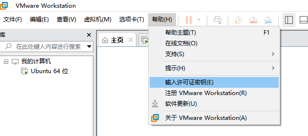

    按上图位置找到输入许可证密钥的位置，点击进入，弹出如下画面：

    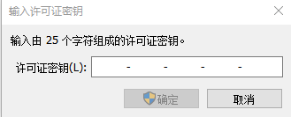

    将 vmware密钥.txt 文件中的密钥拷贝到输入框激活即可。

4. 创建一个虚拟机上的 Ubuntu 系统

   先打开虚拟机，然后点击创建新的虚拟机，如下图：

    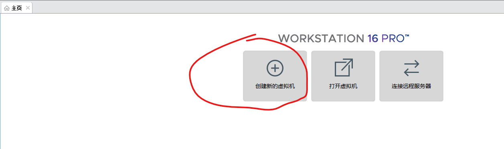

    然后点击下一步，跳转到如下页面：

    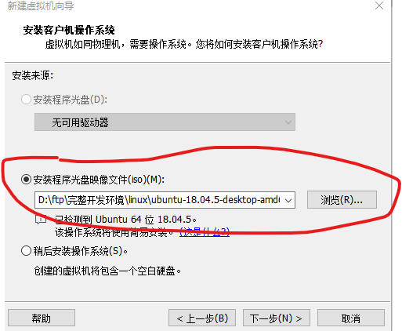

    按上图选择 Ubuntu 系统的镜像 ubuntu-18.04.5-desktop-amd64.iso，位置在 linux 目录下。然后点击下一步，弹出如下画面：

    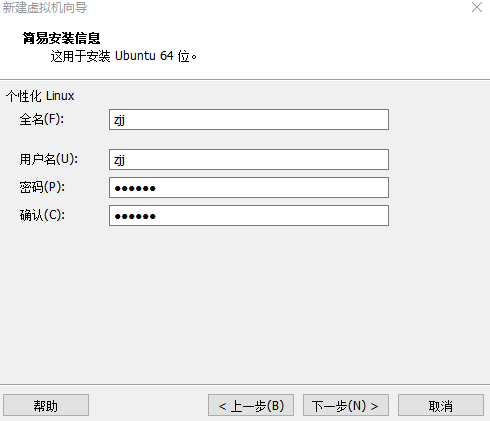

    输入自定义的名称及密码，然后点击下一步，弹出如下画面:

    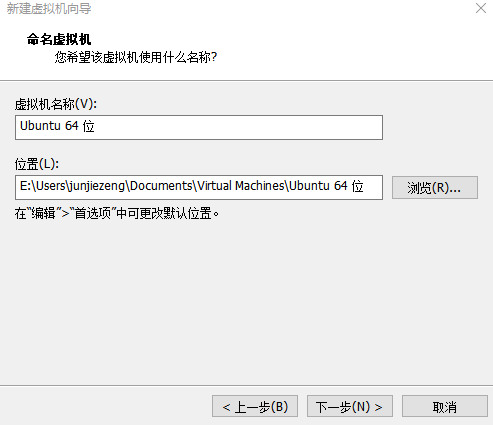

    此时，可以根据实际情况选择安装位置，我的 C 盘空间不够，就安装在 E 盘,然后点击下一步，弹出如下画面：

    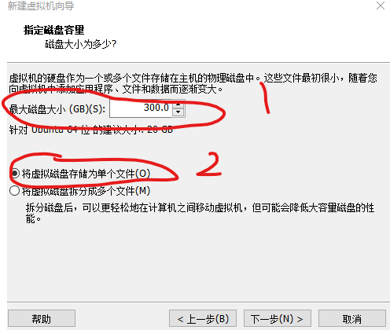

    我的 E 盘比较大分配了 300 个 G，然后选择的是单个文件，这个也可以根据自己电脑的实际情况配置。然后点击下一步，弹出最后一个画面：

    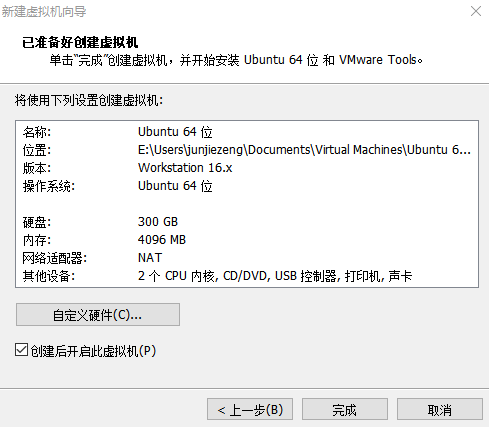

    点击完成即可，接下来就是漫长的安装了，等待安装完成即可。

5. 接下来就是进入到 Ubuntu 系统中，通过 FTP 将 Linux 需要安装的安装包拷贝到 Ubuntu 系统本地：

    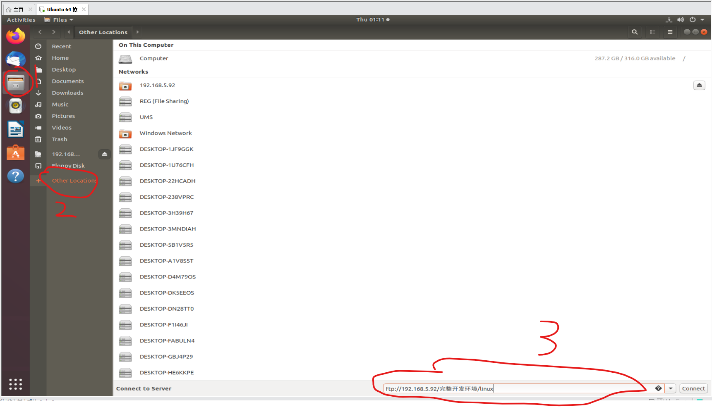

    按照上图步骤访问 FTP 服务器进行访问，将 clang+llvm-10.0.0-x86_64-linux-gnu-ubuntu-18.04.tar.xz、qt-opensource-linux-x64-5.14.1.run、MVS-2.0.0_x86_64_20191126.zip 的拷贝到 Ubuntu 即可。  比如，拷贝到 home 目录下。

6. Qt 安装

   同样先断网，然后在 home 目录下打开终端，输入指令 `./qt-opensource-linux-x64-5.14.1.run` 安装 Qt，如下图：

    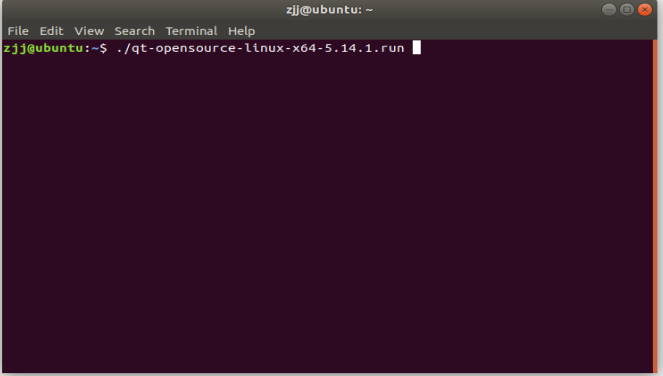

    接下来就会弹出可视化界面安装 Qt，按照提示一直下一步，弹出如下界面时，

    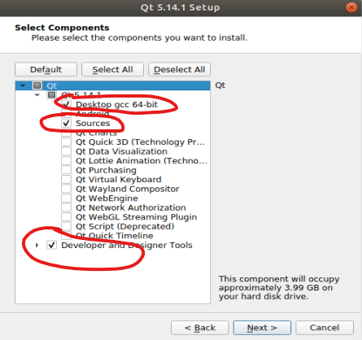

    按上图勾选即可，然后继续下一步，直至安装完毕。

7. 安装海康的相机 SDK

   进入到 hik 文件加下，将 MVS-2.0.0_x86_64_20191126.zip 解压出来，进入到 MVS-2.0.0_x86_64_20191126 文件夹下，打开终端，输入安装指令，如下图：

    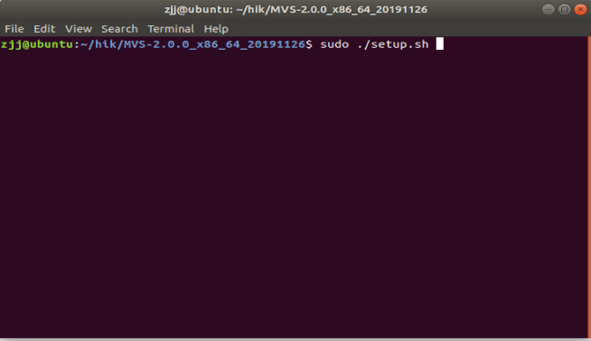

    等待安装完成即可。

8. 安装 gcc、g++、cmake、git

   在终端先输入指令：`sudo apt update` ，然后再输入 `sudo apt install build-essential cmake git` 进行安装，如下图：

    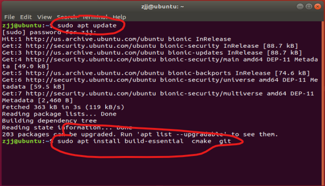

9. Git 安装完后，配置一下 Git 的账号及邮箱，在终端输入如下指令：

    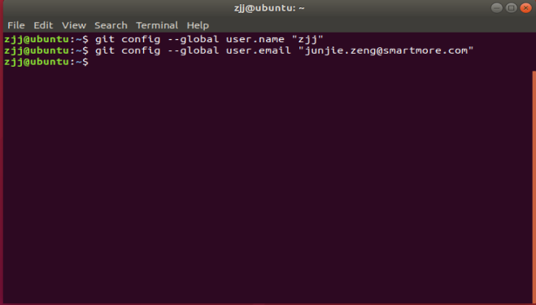

10. 安装 LLVM 工具,在 FTP 服务器的 linux 目录找到 clang+llvm-10.0.0-x86_64-linux-gnu-ubuntu-18.04.tar.xz，拷贝到 Ubuntu 的 home 目录下，解压即可。

11. Qt Creator 配置 clangformat 插件

    打开Qt Creator,找到 About Plugins,

    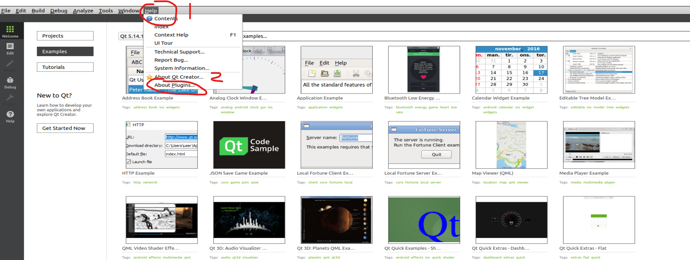

    点击进入，弹出如下窗口：

    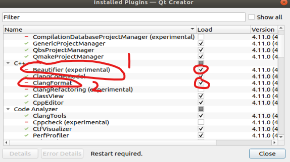

    把上图两项勾选上，然后关闭，重启 Qt Creator 软件。重启软件后，找到如下位置：

    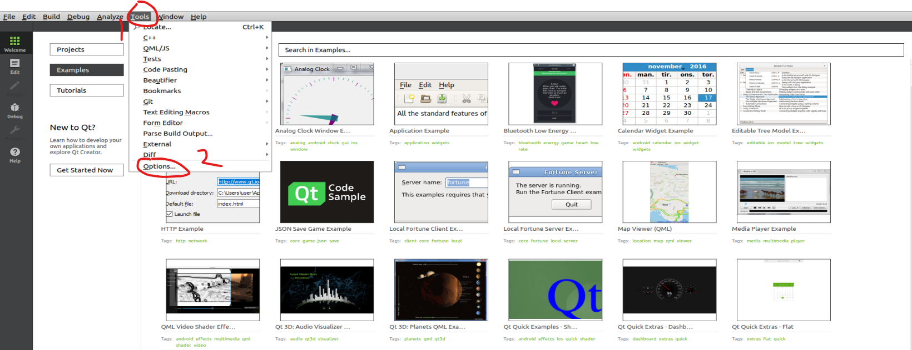

    进入 options,弹出如下窗口：

    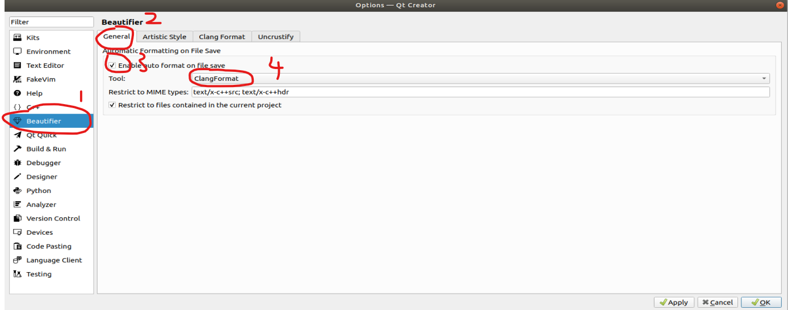

    按上图步骤配置 General 页面，此外还需在 Clang Format 页面，做如下配置：

    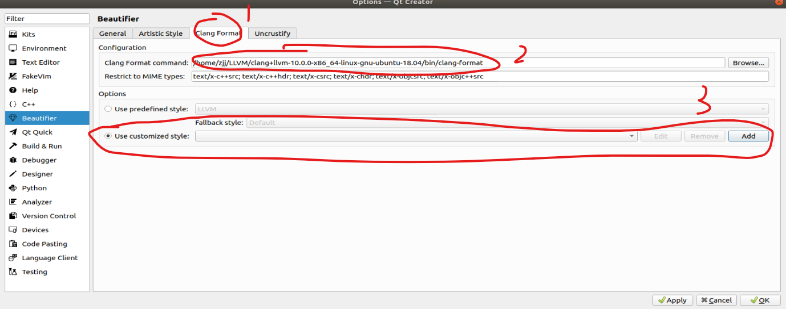

    然后点击在第三步点击 Add,弹出如下界面：

    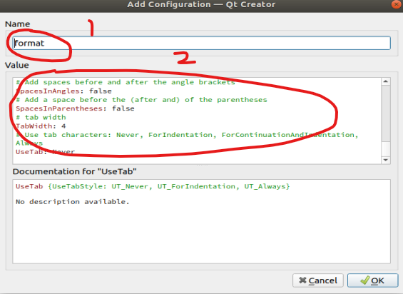

    自定义一个名称，需要将格式化规则填到 Value 的编辑框中，目前 VTK 代码的格式化规则在 FTP 服务器 windows 目录下的 clangformat.txt 文件中，找到该文件，打开并将文件的内容复制到上图的 Value 的编辑框中即可。

12. 解决编译报错问题：

    1. 如果编译出现 "cannot find -lGL" 错误，创建一个软连接
    `sudo ln -s /usr/lib/x86_64-linux-gnu/libGL.so.1 /usr/lib/libGL.so`。

**至此，Linux 开发环境就已搭建完全。**

## **代码篇：**

1. 环境全部配置好后，就可以开始软件的开发了，VTK 软件的源代码仓库在公司 GitHub 的[位置](https://github.com/smartmore/vtk-runtime.git)。首先，需要将自己的 GitHub 账号告知超哥，让他把你加入到开发团队中，并开通代码仓库的访问权限。

2. 开通访问权限后，用 Git 工具将仓库的源代码拉取到本地。

3. 此时还需要从内部的 JFrog 服务器上拉取 VTK 软件依赖的一些库及头文件，库及头文件打包在一起，存放位置如下图：

    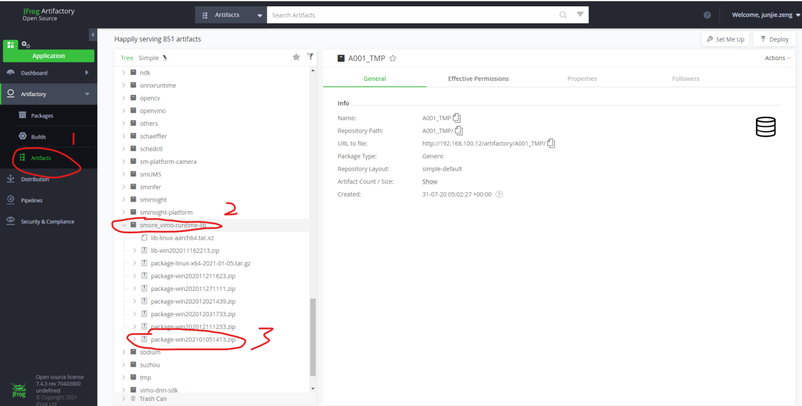

    此时，也是先要找超哥申请一个账号，然后拉取最新的依赖包，windows 和 Linux 的依赖包分开存放，都有标识标记，按需获取最新的即可。

4. VTK 完整的目录结构如下图：

    ```
    ├─include
    │  ├─algo
    │  ├─camera
    │  ├─onnxruntime
    │  ├─opencv
    │  ├─sodium
    │  ├─spdlog
    │  └─teledyne
    ├─lib
    │  ├─algo
    │  ├─camera
    │  ├─cuda
    │  ├─onnxruntime
    │  ├─opencv
    │  ├─sodium
    │  ├─teledyne
    │  ├─tensorrt
    │  └─vcruntime
    └─src
    　　├─aialgoservice
    　　├─cameraservice
    　　├─common
    　　├─configdatamanager
    　　├─imagesaver
    　　├─logservice
    　　├─runtimecontroller
    　　├─translations
    　　└─uiframe
    　　　　├─commonuiset
    　　　　├─configuiset
    　　　　├─font
    　　　　├─images
    　　　　├─mainuiset
    　　　　└─style
    ```

    其中 include 和 lib 放置的是一些外部依赖的库及对应的头文件，在开发过程中，可能会不定期的更新依赖，主要是更新 algo（算法SDK）及 camera（相机SDK）文件夹下的依赖。另外就是 VTK 源代码，在 src 路径下整个代码由 ui 模块、运行控制模块、日志模块、图像保存模块、数据配置管理模块、相机服务模块、算法服务模块、通用模块以及一些辅助文件（资源文件、脚本文件、翻译文件）构成。

5. VTK 团队软件开发已有相应的编码规范，[编码规范地址](http://confluence.sm/pages/viewpage.action?pageId=8849467)，可以先访问学习一下，后续开发过程严格按照规范执行，后续有补充的，也可提出进行更新。访问此处前，也要先申请一个 Confluence 账号，申请开通找陈工（相屹）。

6. 整个工程中心团队的一些[知识技术沉淀](https://github.com/smartmore/engineering-wiki)，可以访问学习一下。
